# GitHub Actions 自动构建指南

本文档说明如何使用 GitHub Actions 自动构建小红书数据抓取工具。

## 📋 目录

- [功能概述](#功能概述)
- [前置条件](#前置条件)
- [使用方式](#使用方式)
- [工作流说明](#工作流说明)
- [常见问题](#常见问题)

## 🎯 功能概述

项目已配置两个 GitHub Actions 工作流：

### 1. 自动构建 (build.yml)

**触发条件：**
- 推送代码到 `master` 或 `main` 分支
- 创建 Pull Request
- 手动触发（在 Actions 页面）

**构建平台：**
- ✅ Windows (`.exe`)
- ✅ macOS (可执行文件)
- ✅ Linux (可执行文件)

**输出位置：**
- GitHub Actions Artifacts（保存 30 天）

### 2. 发布构建 (release.yml)

**触发条件：**
- 创建版本 tag（如 `v1.0.0`）
- 创建 GitHub Release
- 手动触发

**构建平台：**
- ✅ Windows (`.exe`)
- ✅ macOS (可执行文件)
- ✅ Linux (可执行文件)

**输出位置：**
- GitHub Releases 页面

## 📦 前置条件

### 1. 推送代码到 GitHub

如果你当前代码在其他平台（如 code.kuaizu.cn），需要添加 GitHub 远程仓库：

```bash
# 添加 GitHub 远程仓库
git remote add github https://github.com/你的用户名/xhs-assistant.git

# 推送到 GitHub
git push github master
```

### 2. 启用 GitHub Actions

推送代码后，GitHub Actions 会自动启用。你也可以手动检查：

1. 进入 GitHub 仓库页面
2. 点击 **Actions** 标签
3. 如果提示需要启用，点击 **I understand my workflows, go ahead and enable them**

## 🚀 使用方式

### 方式 1：自动构建（推荐用于开发测试）

**步骤：**

1. **提交代码**
   ```bash
   git add .
   git commit -m "feat: 添加新功能"
   git push origin master
   ```

2. **查看构建状态**
   - 进入 GitHub 仓库
   - 点击 **Actions** 标签
   - 查看最新的工作流运行状态

3. **下载构建产物**
   - 等待构建完成（约 5-10 分钟）
   - 进入该次构建详情页
   - 滚动到页面底部的 **Artifacts** 区域
   - 下载对应平台的文件：
     - `xhs-assistant-windows.exe`
     - `xhs-assistant-macos`
     - `xhs-assistant-linux`

### 方式 2：发布构建（推荐用于正式版本）

**步骤：**

1. **创建版本 tag**
   ```bash
   # 创建带注释的 tag
   git tag -a v1.0.0 -m "第一个正式版本"

   # 推送 tag 到 GitHub
   git push origin v1.0.0
   ```

2. **自动构建和发布**
   - GitHub Actions 自动检测到 tag
   - 开始构建所有平台
   - 自动创建/更新 GitHub Release
   - 上传构建产物到 Release

3. **用户下载**
   - 进入 GitHub 仓库的 **Releases** 页面
   - 选择对应的版本
   - 下载对应平台的文件

**版本号规范：**

遵循语义化版本（Semantic Versioning）：

- `v1.0.0` - 正式版本
- `v1.1.0` - 新增功能
- `v1.1.1` - Bug 修复
- `v2.0.0` - 重大更新/不兼容变更

### 方式 3：手动触发构建

**步骤：**

1. 进入 GitHub 仓库
2. 点击 **Actions** 标签
3. 选择左侧的工作流：
   - `Build Application` - 普通构建
   - `Release Application` - 发布构建
4. 点击右侧 **Run workflow**
5. 选择分支（默认 master）
6. 点击 **Run workflow** 确认

## 📝 工作流说明

### build.yml - 自动构建工作流

**工作流程：**


**构建矩阵：**

| 平台 | 运行环境 | Python 版本 | 输出文件 |
|------|---------|------------|---------|
| Windows | windows-latest | 3.11 | `xhs-assistant-windows.exe` |
| macOS | macos-latest | 3.11 | `xhs-assistant-macos` |
| Linux | ubuntu-latest | 3.11 | `xhs-assistant-linux` |

**构建时间：**
- Windows: ~5-8 分钟
- macOS: ~4-6 分钟
- Linux: ~3-5 分钟

### release.yml - 发布构建工作流

**工作流程：**



```mermaid
graph LR
    A[创建 Tag] --> B[检出代码]
    B --> C[设置 Python]
    C --> D[安装依赖]
    D --> E[PyInstaller 打包]
    E --> F[重命名文件]
    F --> G[上传到 Releases]
    G --> H[创建发布摘要]
```

**输出文件命名：**

- Windows: `xhs-assistant-windows-v1.0.0.exe`
- macOS: `xhs-assistant-macos-v1.0.0`
- Linux: `xhs-assistant-linux-v1.0.0`

## 🔧 配置文件说明

### 构建配置位置

```
.github/
└── workflows/
    ├── build.yml      # 自动构建工作流
    └── release.yml    # 发布构建工作流

build/
├── windows.spec              # Windows 打包配置
└── build_onefile.spec        # macOS/Linux 打包配置
```

### 修改构建配置

如需修改构建配置，编辑对应的文件：

**1. 修改 Python 版本**
```yaml
# .github/workflows/build.yml
- name: Set up Python
  uses: actions/setup-python@v5
  with:
    python-version: '3.11'  # 修改这里
```

**2. 修改 PyInstaller 版本**
```yaml
# .github/workflows/build.yml
- name: Install PyInstaller
  run: |
    pip install pyinstaller==6.11.0  # 修改这里
```

**3. 修改输出文件名**
```yaml
# .github/workflows/build.yml
artifact_name: 'xhs-assistant-windows.exe'  # 修改这里
```

## ❓ 常见问题

### Q1: 构建失败怎么办？

**A:** 检查以下几点：

1. **查看构建日志**
   - 进入 Actions 页面
   - 点击失败的构建
   - 展开失败的步骤查看详细日志

2. **常见失败原因**
   - 依赖安装失败：检查 `requirements.txt`
   - PyInstaller 打包失败：检查 `.spec` 文件
   - 测试失败：检查代码逻辑

3. **本地测试**
   ```bash
   # 本地运行 PyInstaller 测试
   pyinstaller build/windows.spec
   ```

### Q2: 构建产物在哪里？

**A:** 有两个位置：

1. **普通构建** (build.yml)
   - 位置：Actions → Artifacts
   - 保存时间：30 天
   - 用途：开发测试

2. **发布构建** (release.yml)
   - 位置：Code → Releases
   - 保存时间：永久
   - 用途：正式版本

### Q3: 如何调试构建问题？

**A:** 使用 `tmate` 调试：

```yaml
# 在工作流中添加调试步骤
- name: Setup tmate session
  uses: mxschmitt/action-tmate@v3
  if: failure()  # 仅在失败时启动
```

### Q4: 构建时间太长？

**A:** 优化建议：

1. **启用缓存**（已配置）
   ```yaml
   - name: Set up Python
     uses: actions/setup-python@v5
     with:
       cache: 'pip'  # 缓存 pip 依赖
   ```

2. **并行构建**（已配置）
   ```yaml
   strategy:
     fail-fast: false  # 各平台并行构建
   ```

3. **减少依赖**
   - 清理 `requirements.txt` 中不需要的包

### Q5: 如何仅在特定分支触发构建？

**A:** 修改触发条件：

```yaml
on:
  push:
    branches:
      - master      # 仅 master 分支
      - develop     # 或 develop 分支
      - 'release/**' # 或 release/ 开头的分支
```

### Q6: 如何添加代码签名？

**A:** 添加签名步骤：

```yaml
# Windows 代码签名
- name: Sign Windows executable
  run: |
    signtool sign /f certificate.pfx /p password dist/xhs-assistant.exe
  env:
    CERTIFICATE_PASSWORD: ${{ secrets.CERT_PASSWORD }}
```

### Q7: 构建失败后如何重试？

**A:** 三种方式：

1. **手动重新触发**
   - Actions → 选择工作流 → Run workflow

2. **重新推送 commit**
   ```bash
   git commit --allow-empty -m "rebuild"
   git push origin master
   ```

3. **使用 re-run**
   - 进入失败的构建详情
   - 点击右上角 **Re-run jobs**

## 📊 监控和维护

### 查看构建统计

1. 进入 GitHub 仓库
2. 点击 **Insights** → **Actions**
3. 查看构建趋势和成功率

### 设置构建通知

1. 进入仓库 **Settings**
2. 点击 **Notifications**
3. 配置 Actions 通知方式

## 🎓 最佳实践

### 1. 版本管理

```bash
# 开发版本
git tag -a v1.0.0-beta.1 -m "Beta 版本"
git push origin v1.0.0-beta.1

# 正式版本
git tag -a v1.0.0 -m "第一个正式版本"
git push origin v1.0.0
```

### 2. 发布说明

在创建 Release 时填写发布说明：

```markdown
## 🎉 v1.0.0

### 新增功能
- 支持笔记数据导出
- 支持粉丝数据抓取
- 自动保存登录会话

### Bug 修复
- 修复登录失败问题
- 修复数据导出格式问题

### 下载
- Windows: `xhs-assistant-windows-v1.0.0.exe`
- macOS: `xhs-assistant-macos-v1.0.0`
- Linux: `xhs-assistant-linux-v1.0.0`
```

### 3. 构建前测试

在构建前运行测试：

```yaml
- name: Run tests
  run: |
    python -m pytest tests/
```

## 📚 相关资源

- [GitHub Actions 官方文档](https://docs.github.com/en/actions)
- [PyInstaller 官方文档](https://pyinstaller.org/en/stable/)
- [语义化版本规范](https://semver.org/lang/zh-CN/)

## 🆘 获取帮助

如遇到问题：

1. 查看 [GitHub Actions 文档](https://docs.github.com/en/actions)
2. 搜索已有的 [GitHub Issues](https://github.com/wailsapp/wails/issues)
3. 在项目仓库提 Issue

---

**更新日期**: 2025-01-09
**文档版本**: 1.0
